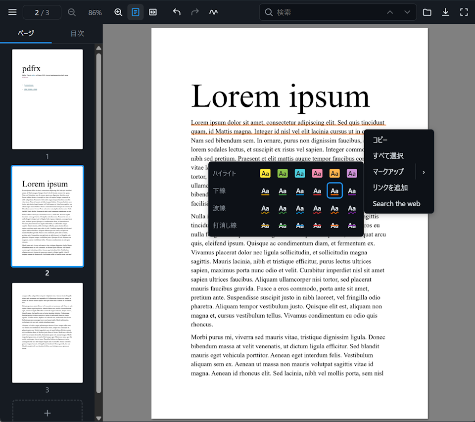

# pdfrx_web

[](https://www.npmjs.com/package/@pdfrx/viewer)
[](https://espresso3389.github.io/pdfrx_web/demo-react/)
[](https://espresso3389.github.io/pdfrx_web/)
[](LICENSE)

A TypeScript PDF toolkit for the browser: a PDFium/WASM engine, a
framework-agnostic canvas viewer, ready-made React UI, and collaborative
editing support.

**[React demo](https://espresso3389.github.io/pdfrx_web/demo-react/)** ·
**[Vanilla demo](https://espresso3389.github.io/pdfrx_web/demo/)** ·
**[API reference](https://espresso3389.github.io/pdfrx_web/)** ·
**[Documentation](https://github.com/espresso3389/pdfrx_web/blob/master/docs/README.md)**



## Choose a package

| Package | npm | Use it for |
|---|---|---|
| [`@pdfrx/react`](packages/react) | [npm](https://www.npmjs.com/package/@pdfrx/react) | A ready-made React viewer, composable UI, or headless hooks. |
| [`@pdfrx/viewer`](packages/viewer) | [npm](https://www.npmjs.com/package/@pdfrx/viewer) | A framework-agnostic canvas viewer or custom element. |
| [`@pdfrx/engine`](packages/engine) | [npm](https://www.npmjs.com/package/@pdfrx/engine) | Rendering, extraction, editing, and encoding without viewer UI. |
| [`@pdfrx/colab`](packages/colab) | [npm](https://www.npmjs.com/package/@pdfrx/colab) | Multi-user page, annotation, and form synchronization. |
| [`@pdfrx/viewer-core`](packages/viewer-core) | [npm](https://www.npmjs.com/package/@pdfrx/viewer-core) | DOM-free geometry, layout, text, and selection logic. |

Higher-level packages install their lower-level dependencies automatically.
Most React applications should start with `@pdfrx/react`.

## React quick start

```sh
npm install @pdfrx/react react react-dom
```

```tsx
import { PdfrxViewerApp } from '@pdfrx/react';
import '@pdfrx/react/styles.css';

export function App() {
  return (
    <PdfrxViewerApp
      src="/manual.pdf"
      wasmModulesUrl="/pdfium/"
      style={{ height: '100dvh' }}
    />
  );
}
```

Copy `pdfium_worker.js` and `pdfium.wasm` from
`node_modules/@pdfrx/engine/assets/` into your public `/pdfium/` directory.
See the [`@pdfrx/react` README](packages/react) for composition and API links.

## Framework-agnostic quick start

```sh
npm install @pdfrx/viewer
```

```html
<script type="module">
  import { definePdfrxViewerElement } from '@pdfrx/viewer';
  definePdfrxViewerElement();
</script>

<pdfrx-viewer
  src="/manual.pdf"
  wasm-modules-url="/pdfium/"
  style="width: 100%; height: 100dvh"
></pdfrx-viewer>
```

See the [`@pdfrx/viewer` README](packages/viewer) for the class-based API.
Remote PDF URLs must allow browser CORS access.

## Features

- Sharp single-canvas rendering that re-renders at the active zoom, backed by a
  PDFium WASM worker with cancellable and partial-region rendering
- Desktop- and touch-friendly text selection, search, links, outline,
  thumbnails, animated navigation, and custom page layouts
- Interactive AcroForms plus annotation editing for ink, shapes, markup,
  notes, FreeText, images, snapping, and multi-selection
- One Undo/Redo history across annotations, forms, page insertion, deletion,
  reorder, duplication, and rotation
- Non-destructive PDF export that can preserve the live document and its edit
  history while encoding a temporary copy
- Ready-made responsive React UI, composable components, headless hooks,
  localization, theming, and framework-agnostic APIs
- Optional revision-checked collaboration with transient previews,
  authoritative late-join snapshots, and mixed-source PDF composition
- Browser, Node.js, Bun, and Deno support at the engine layer

Detailed behavior belongs in the
[topic guides](https://github.com/espresso3389/pdfrx_web/blob/master/docs/README.md)
and
[API reference](https://espresso3389.github.io/pdfrx_web/).

## Development

```sh
npm install
npm run build
npm test
npm run dev:react
```

Other examples use `npm run dev` and `npm run dev:colab`. See
[AGENTS.md](https://github.com/espresso3389/pdfrx_web/blob/master/AGENTS.md) for
repository workflows and release requirements.

## License

MIT — see [LICENSE](LICENSE).
