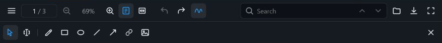
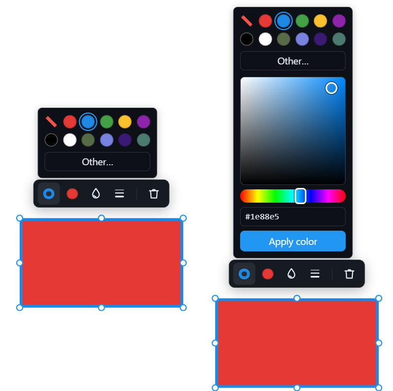
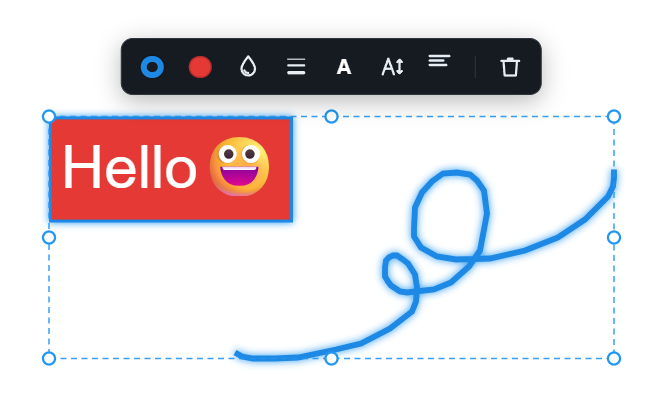

# Annotation toolbar and object editing

This guide describes the standard
[`PdfAnnotationToolbar`](https://espresso3389.github.io/pdfrx_web/functions/_pdfrx_react.PdfAnnotationToolbar.html)
provided by `@pdfrx/react`. For viewer setup and component composition, start
with the [`@pdfrx/react` guide](REACT-GUIDE.md).

The toolbar starts in object-selection mode. Its leading buttons switch between
object and text selection, followed by the available creation tools.

## Properties and color

The toolbar reflects the common stroke, fill, text, opacity, thickness, size,
and alignment of the current annotation selection. A mixed value is shown as
unselected until the user explicitly chooses a replacement. Explicit choices
become the defaults for subsequently created objects and are restored from
`localStorage` on the next visit.

The color popup includes the preset swatches, four least-recently used
custom-color slots, and an inline HSV picker with direct `#RRGGBB` input. HSV
changes live-preview the selected objects without writing the PDF or undo
history; **Apply color** commits the result, while Escape or an outside click
restores the original display.

Text controls follow line thickness and provide independent text color and
font-size settings plus one alignment button whose popup is a 3 × 3 position
picker (left/center/right combined with top/middle/bottom). Choosing one
position updates both selected rectangle/FreeText annotations and future text
box defaults. Alignment is persisted in the PDF and retained when color, size,
or other styles change.

## Image and Note annotations

The toolbar deletes the current selection and adds image stamps from its image
picker. Picked images are centered on the current page; dropped images use the
drop point. Their initial placement is capped at 240 PDF points wide and fitted
to the page, but that placement does not determine the embedded resolution:
raster inputs retain their decoded pixels up to a 2048-pixel longest side, and
SVG inputs remain vector paths. Repeated image resize operations reuse the
retained source pixels instead of progressively resampling PDFium's transformed
appearance.

The viewer keeps Text/Note annotations interactive outside object-selection
mode. In normal viewing mode, clicking a Note icon opens a read-only popup and
clicking outside closes it. Dragging the lower-right corner enlarges or shrinks
the reading area; its invisible resize target remains fixed while the Note body
scrolls. Initial placement and size are clamped to the viewer viewport. That
popup geometry is transient UI state only and is never stored in the annotation,
undo history, or exported PDF.

## Rectangle and FreeText editing

The rectangle tool creates the same GUI object: placing a rectangle does not
automatically start typing, while double-clicking either a rectangle or FreeText
annotation opens localized inline editing. Adding non-blank text converts the
rectangle to FreeText; clearing all text converts it back to a plain square.

A single selected rectangle also accepts direct keyboard or IME input; the
native editor is armed before the first character, re-armed after an
outside-click commit, and can also be opened by double-clicking the selected
object. Text-bearing FreeText accepts a double-click across its text/background
area. Unselected hollow rectangles use their outline for hit testing; once
selected, their complete bounds accept object interaction.

The inline editor follows the annotation stroke, text color, font size,
horizontal and vertical alignment, wrapping, and clipping while it is resized.
The browser textarea resize grip is disabled. Its text uses the annotation's
current text color. The editing background uses the fill color at full opacity,
or white when no fill is set.

## Selection and keyboard controls

Opening the annotation toolbar enters annotation-object mode; its leading mode
buttons can explicitly switch between object and text selection while the
toolbar remains open. Closing the toolbar always returns to normal
viewing/text-selection mode. Holding `Alt`/`Option` temporarily swaps those
modes and updates the active mode button.

In annotation mode, a primary click selects one object, primary-button object
and anchor drags move or reshape it, and primary-button drag from empty page
space updates a marquee selection continuously. Objects that leave the marquee
are removed from the selection; holding `Ctrl`/`Cmd` preserves the existing
selection and adds intersecting objects. The same modifier toggles objects on
click.

Pen strokes, straight lines, and arrows are clickable only near their actual
segments (with a slightly wider touch target); unfilled rectangles and ellipses
are clickable only on or near their outlines until selected, after which their
complete bounds accept object interaction. A marquee uses the same shape-aware
intersections rather than plain bounding rectangles.

Annotation creation, body drags, and anchor drags snap to nearby coordinates on
other annotations and display alignment guides (freehand ink creation remains
unsnapped). `Ctrl`/`Cmd`+`A` selects all text unless at least one annotation is
selected, in which case it selects every annotation on the current page.
`Delete`/`Backspace` removes the selected objects. Arrow keys move them by one
screen pixel, or ten screen pixels while Shift is held, with page bounds and
page rotation respected.

## Floating property toolbar

When one or more annotation objects are selected, their stroke, fill, opacity,
thickness, and text controls appear in a floating property toolbar. The toolbar
prefers the side away from the object: below for objects centered in the upper
viewport half and above for objects centered in the lower half. Nested property
panels continue in the same direction when space permits; unavoidable overflow
is shifted back inside the viewport. The toolbar follows movement, resize,
zoom, and scrolling. If a mixed selection has no shared property controls, the
popup collapses to the delete button without reserving space for an empty
control group.
